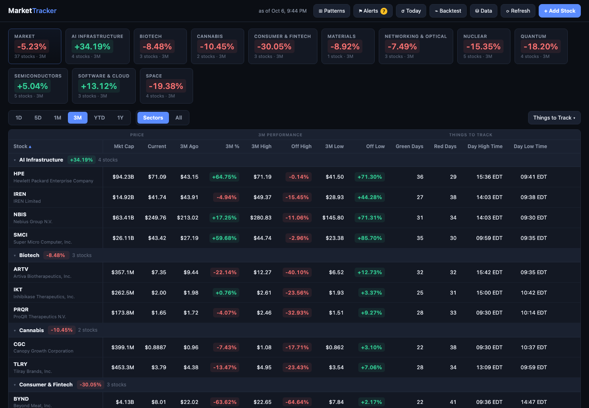

# Market Tracker

A local, free, self-hosted stock-tracking dashboard. Add the tickers you care about,
group them into **sectors**, and read the whole market at a glance — with a period
selector (1D / 5D / 1M / 3M / YTD / 1Y) that recomputes every column, plus pluggable
**"Things to Track"** analytics columns (green/red day counts, time of the day's
high/low, and anything you add next).

Price data comes from Yahoo Finance via [yfinance](https://github.com/ranaroussi/yfinance) —
no API key, no cost.



## Quick start

```bash
./run.sh            # creates venv + installs deps on first run
# open http://127.0.0.1:8000
```

Requires Python 3.12 (Homebrew: `brew install python@3.12`).

## Tests

```bash
pip install -r requirements-dev.txt
pytest -q                            # 130 backend tests
node --test tests/frontend/*.test.mjs  # 18 frontend tests, no npm needed
ruff check app/ tests/ scripts/
```

The same three commands run in CI on every push and pull request
(`.github/workflows/ci.yml`). Nothing in the suite touches the network or the
real `data/tracker.db` — price data is synthetic and the API tests run against a
throwaway SQLite file.

The backtest fixtures are the load-bearing ones: they pin the engine's honesty
invariants (no look-ahead, conservative fills, stop-assumed-before-target, no
entry-day take-profit) with expectations computed by hand, so a change in
behavior surfaces as a specific arithmetic mismatch. Each was verified to fail
against deliberately broken code before being trusted.

## How it works

- **Sectors & stocks** live in SQLite (`data/tracker.db`). First run seeds a
  27-stock portfolio across 9 thematic sectors. Add/move/remove stocks from the
  UI — tickers are validated against Yahoo before they're saved.
- **Sectors | All toggle**: keep the table grouped by sector, or flatten the
  whole portfolio into one cross-sector table — sort by any column (e.g. rank
  everything by market cap) and stack numeric threshold filters
  (`Mkt Cap ≥ 10B`, `3M % ≤ 0`) with a live "showing X of Y" count. Grouping
  and filters persist like the rest of the view state (`?group=all` works as a
  URL override too).
- **One batched fetch** per period pulls daily OHLC bars for *all* tracked tickers
  in a single `yf.download` call, behind a 10-minute in-memory TTL cache
  (5 minutes for intraday). The ⟳ Refresh button bypasses the cache.
- **Live current price**: 1-minute intraday bars (fetched for the time-of-day
  metrics anyway) are folded into the daily window as a synthetic bar, so Current
  Price stays live during market hours and survives Yahoo's occasional missing
  daily close.
- **Failure isolation**: a delisted or data-less ticker renders as a dimmed
  "no data" row and is excluded from sector averages; if Yahoo is down
  entirely, the last cached table is served with a "cached" badge instead of an
  error page.

### Period semantics

| Period | "Ago" reference | High / Low window |
|---|---|---|
| 1D | previous session close | today's session |
| 5D | close 5 trading days back | last 5 sessions |
| 1M / 3M / YTD / 1Y | first close of the window | whole window |

Percentages: `%` = current vs ago · `Off High` = current vs period high (≤ 0) ·
`Off Low` = current vs period low (≥ 0).

## Stock detail view & AI analysis

Click any ticker to open its detail panel (`#/stock/NVDA` — bookmarkable):
an SVG price chart with its own timeframe selector (1D shows the live
1-minute intraday line; 5D–1Y slice the daily closes), a fundamentals grid
(valuation, margins, 52-week range, analyst consensus and mean target,
earnings date), the daily-range statistics matrix for the selected timeframe,
recent headlines, and an **AI Analysis** — a stored research note covering
what the company does, real performance numbers, strengths, risks, and what
to watch.

Analyses live in SQLite (`stocks.analysis`) and are written/refreshed by
[`scripts/seed_analyses.py`](scripts/seed_analyses.py), which also reports any
tracked ticker that's missing one. They are informational research notes only
— deliberately no buy/sell/hold recommendations — and the UI labels them as
not investment advice.

## The knowledge vault (Obsidian)

The tracker reads a dedicated Obsidian vault at `~/Documents/Stocks Vault`
(override with the `STOCKS_VAULT` env var), structured as a
[Karpathy-style LLM wiki](https://gist.github.com/karpathy/442a6bf555914893e9891c11519de94f):

- **Raw sources** — `Articles/` (immutable once ingested) and `_inbox/` for
  dropping files to ingest
- **Wiki** — `Stocks/` and `Sectors/` notes with dated, source-linked **Facts**
  and **Speculations** (`status: open|confirmed|busted`)
- **Schema** — `SCHEMA.md` (the conventions Claude follows), plus `index.md`
  (catalog) and `log.md` (append-only history)

Workflows (run in Claude Code from this repo):
- `/ingest-article <url-or-inbox-file>` — fetches the article, **fact-checks
  claims** against market data and the web, routes takeaways into the right
  stock/sector notes with provenance links, and records every mentioned
  ticker's price at publication
- `/vault-lint` — contradiction/staleness/orphan checks across the wiki
- `scripts/refresh_article_prices.py` — refreshes each article's
  "price since publication" table

The app renders the vault read-only: stock detail views show the note's
Facts/Speculations plus an article price-impact table (price at publication →
now, computed live), and clicking a sector summary card opens the sector note.
The vault is also the grounding source when AI analyses are regenerated.
If the vault is missing, the app simply hides those sections.

### Replicating the vault for any topic

[`scripts/create_llm_wiki.py`](scripts/create_llm_wiki.py) is a standalone,
stdlib-only scaffolder that generates a complete Karpathy-style LLM-wiki vault
for **any** subject — folders, `SCHEMA.md`, `index.md`, `log.md`, entity +
category notes, and topic-adapted `/ingest-article` + `/vault-lint` skills:

```bash
# Any topic, from a small JSON config (see the script's docstring):
python3 scripts/create_llm_wiki.py my-topic.json

# Reproduce this repo's Stocks Vault (and export a portable config):
python3 scripts/create_llm_wiki.py --from-tracker data/tracker.db \
        --export-config stocks-vault.json
```

It never overwrites existing files, so it's safe to run over a live vault.

## Database view

The **⛁ Data** button (or `#/db`) opens a read-only view of everything the
app stores and caches: the raw `stocks`/`sectors` SQLite tables (every row and
column, sortable and filterable), per-stock expandable **daily OHLCV bars**
(the actual datapoints behind the metrics, for any period), and a status strip
— DB file size, fetch-cache freshness vs TTLs, and vault note/article counts.

## Daily range statistics

Every stock's detail view includes a **Daily Range Stats** matrix for the
selected period: 11 intraday relationships (PC→High, PC→Low, PC→Close,
Gap, Open→Close/High/Low, Low→High, High→Low, High→Close, Low→Close) ×
5 aggregates (average, median, min, max — each extreme with its date — and
standard deviation). It answers "how does this stock *behave* in a typical
day": average stretch above the previous close, average dip below it, typical
fade off the high, and so on. All 55 statistics are also available as
toggleable main-table columns via the "Things to Track" picker (off by
default), so any of them can be compared across the whole portfolio.

## Decision-support tools (descriptive only — never advice)

Two pages turn the range statistics into context. By design, neither produces
buy/sell/hold output, signals, or position advice — they compute history and
context; decisions stay with you.

- **⌁ Backtest** (`#/backtest`): define a rule in the stats vocabulary —
  entry at a % or σ dip below the previous close, optional second tranche,
  target as % or × average daily range, stop, time stop, costs — and simulate
  it over ~1 year of daily bars, per ticker or across the whole portfolio.
  Honesty is built in: trailing stats are shifted a day (**no look-ahead
  bias**), limit fills require the day's range to actually reach the price,
  gaps fill at the open, same-day stop+target resolves **stop-first**, no
  entry-day take-profit, costs default on, and every result sits next to
  buy-&-hold for the same span. The engine is fixture-tested against
  hand-computed outcomes (`/tmp`-style synthetic bars) and audited against
  raw Yahoo data.
- **σ Today** (`#/deviations`): each stock's latest session expressed as
  z-scores against its own trailing 63-day distribution (day change, dip,
  stretch, range). ±2σ days light up. It describes how unusual today is —
  nothing more.

Both pages carry their assumptions in the UI. Historical simulation is not
prediction; past results do not transfer to the future.

## Adding a new "Thing to Track"

Each extra column is one registered function in [`app/metrics.py`](app/metrics.py).
Add a function and it automatically appears in the UI's column picker — no frontend
changes needed:

```python
@metric("range_pct", "Avg Daily Range", fmt="text",
        description="Average high-to-low range per day in the period")
def range_pct(daily, intraday):
    if daily is None or daily.empty:
        return None
    r = ((daily["High"] - daily["Low"]) / daily["Close"]).mean()
    return f"{r * 100:.1f}%"
```

## API

| Endpoint | Purpose |
|---|---|
| `GET /api/overview?period=3M[&refresh=true]` | Full table payload: sectors, stocks, core metrics, Things-to-Track values |
| `GET /api/stocks/{ticker}/detail` | Detail-view payload: 1Y chart series, fundamentals, news, vault note + article price impact, stored AI analysis |
| `GET /api/sectors/{id}/note` | The sector's vault note (404 when none) |
| `GET /api/db` · `GET /api/db/prices/{ticker}?period=1Y` | Read-only DB dump + raw daily OHLCV bars |
| `POST /api/backtest` · `GET /api/deviations` | Rule simulation over history · today-vs-typical z-scores |
| `POST /api/stocks` | Track a ticker (`{ticker, sector_id}` or `{ticker, new_sector_name}`) |
| `PATCH /api/stocks/{id}` | Move a stock to another sector |
| `DELETE /api/stocks/{id}` | Stop tracking |
| `GET /api/sectors` · `DELETE /api/sectors/{id}` | List sectors · delete an empty sector |

## Highlights

- Designed and built a full-stack market-tracking dashboard: **FastAPI** REST API +
  dependency-free vanilla-JS single-page UI with a dark, density-first table design
- Engineered a **TTL-cached batch data layer** over the Yahoo Finance API (yfinance)
  that collapses N tickers × M metrics into two batched requests, with stale-cache
  fallback for upstream outages
- Built a **pluggable metrics registry** — new analytics columns are single
  decorated Python functions that flow through to a dynamic, user-toggleable UI
  column picker with persisted preferences
- Implemented **SQLite persistence** with validated CRUD endpoints and
  graceful degradation for delisted tickers and partial price history
- Synthesized live intraday bars into daily windows so current prices stay
  real-time during market hours despite upstream daily-feed lag
- Built a **file-based LLM-maintained knowledge system** (Karpathy LLM-wiki
  pattern) over an Obsidian vault: article ingestion with automated
  fact-checking, provenance-linked knowledge routing, per-source price-impact
  tracking, and read-only API/UI integration — deliberately RAG-free at this
  scale
- Established a **148-test behavior suite and CI pipeline** (GitHub Actions:
  lint, backend, frontend) covering the HTTP contract, concurrency, and
  financial-simulation correctness — with every invariant verified to fail
  against deliberately broken code before being trusted as a gate
- Hardened a **thread-safe TTL cache** by scoping locks per cache slot so a slow
  upstream fetch can no longer stall unrelated reads, with regression tests that
  assert concurrent fetches overlap rather than serialize

## Limitations

- Quotes are Yahoo's (15–20 min delayed for some exchanges); this is a tracker,
  not a trading terminal
- Prices are displayed in the listing currency with a `$` prefix — non-USD
  listings (e.g. `.TO` tickers) aren't currency-converted
- Single-user by design: the cache is in-process and the DB is a local file
